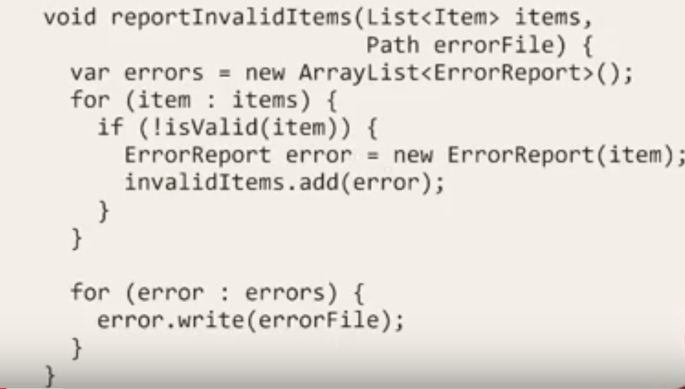
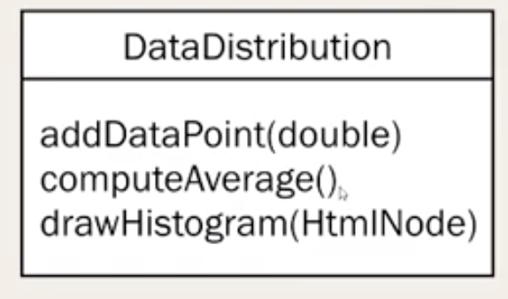

# SOLID principle
- Single responsibility principle
- Open/Closed principle
- Liscov substitution principle
- Interface segregation principle
- Dependency inversion principle
# Single responsibility principle
Every module should do only one thing
- Method/function
- Class
- Package/Namespace
Following is function violating single responsibility principle

Following are problems with this function
- It does two things
- First it filter items and find out invalid items
- Second it writes invalid item in file
- It makes unit testing little complex

Following is class violating single responsibility principle

It does add, compute as well as to display data.

Underlying principle of single responsibility is `Separation of Concern`

# Open/Closed principle
- Software entities should be open for extension, but closed for modification. 
- Extend my system to include my new requirement; don't touch existing code
- Proxy pattern, facade pattern etc are few example
# Liscove Substitution Principle
- if `S` is subclass of `T`, then objects of class `T` may be replaced by with objects of class `S`
Following six rules are recommended
- Return type must be covariant 
- Invariant must be preserved
# Interface segregation principle
A client should not be forced to use an interface with method it doesn't need. 
# Dependency inversion principle
- High level principle should not depend on low level module
- Both abstract and and concrete module only depends on abstract modules.

